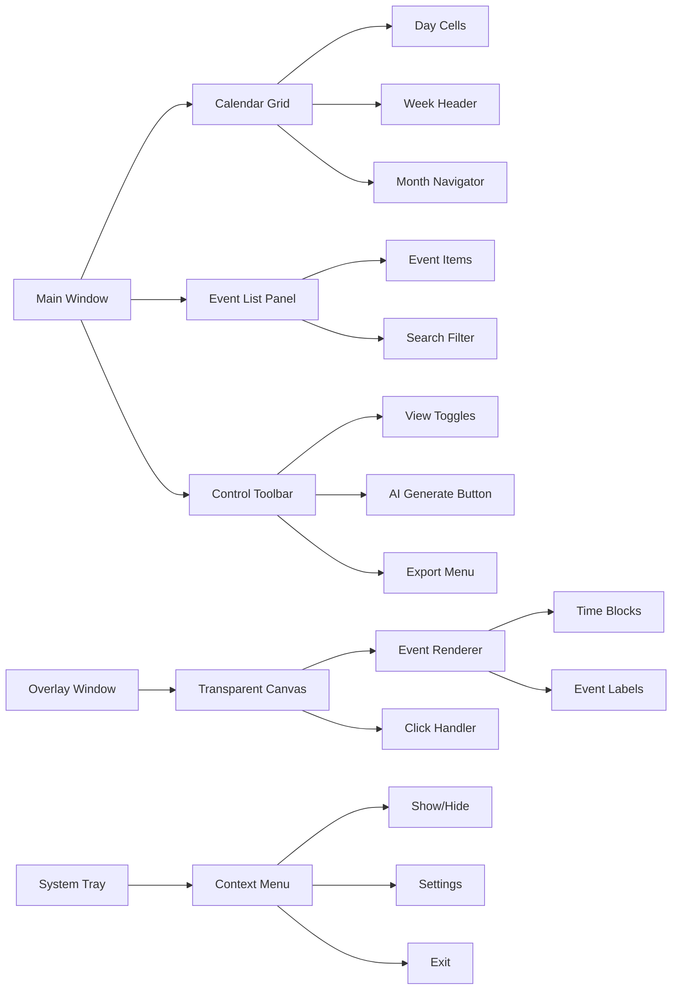

# 🗓️ Desktop Calendar Tracking - AI-Powered Calendar with Native Performance

[](LICENSE)


[](https://github.com/richie-rich90454/desktop-calendar-tracking)

**Desktop Calendar Tracking** is a high-performance, cross-platform desktop application that combines **AI-powered intelligent scheduling** with **transparent desktop overlays**. Built with native technologies (Java Swing, C++/Win32, Swift/AppKit) for maximum efficiency, it delivers professional calendar management without the resource overhead of Electron/Tauri-based alternatives.

**Key Features**
- **🚀 Native Performance**: No Chromium/WebView overhead - uses 50-80% less memory than Electron apps
- **🤖 AI-Powered Scheduling**: Generate events naturally with OpenAI or local Ollama LLMs
- **🖥️ Desktop Integration**: Transparent overlays stay on top of other windows
- **📊 Professional Features**: Advanced validation, multiple views, JSON import/export
- **🔒 Privacy Focused**: Optional local AI with Ollama for complete data privacy

## 🚀 Quick Navigation
| Section | Description | Key Topics |
|---------|-------------|------------|
| [✨ Key Features](#-key-features) | Core capabilities and innovations | AI Scheduling, Desktop Overlay, Calendar Management |
| [📸 Visual Overview](#-visual-overview) | Screenshots and UI breakdown | Application Screenshots, Component Diagrams |
| [🏗️ Technical Architecture](#️-technical-architecture) | System design and components | Java Swing, C++/Swift Overlays, AI Integration |
| [📦 Installation Guide](#-installation-guide) | Getting started quickly | Pre-built Binaries, Source Build, Docker |
| [🔧 Configuration & Setup](#-configuration--setup) | Customization options | AI Providers, Overlay Settings, Data Schema |
| [💻 Development & API](#-development--api) | Developer resources | Java API, AI Integration, Overlay IPC |
| [📊 Roadmap & Future](#-roadmap--future) | Development timeline | Completed, In Progress, Planned Features |
| [🤝 Contributing](#-contributing) | How to contribute | Bug Reports, Code Submission, Guidelines |
| [📄 License](#-license) | Licensing information | MIT License Details |
| [🙏 Acknowledgments](#-acknowledgments) | Credits and thanks | Open Source Projects, Contributors |

**Quick Links**: [Install Now](#-installation-guide) • [View Screenshots](#-visual-overview) • [Try AI Features](#-configuration--setup) • [Contribute](#-contributing)

## ✨ Key Features

### 🤖 **AI-Powered Scheduling** ✅
- **Natural Language Event Generation**: Describe goals like "Create a study schedule for 2 weeks" and AI generates calendar events
- **Multi-Model AI Support**: 
  - **OpenAI Models**: Cloud-based models via REST API
  - **Ollama Local LLMs**: Privacy-focused, offline-capable local models
  - **OpenRouter**: Alternative AI providers via OpenAI-compatible APIs
- **Conflict Detection**: AI considers existing events to avoid scheduling conflicts
- **Token Usage Tracking**: Monitor API token consumption for cost management

### 🖥️ **Desktop Overlay Integration** 🚧
- **Transparent Always-On-Top Windows**: 
  - **Windows**: C++/Win32 implementation (in development)
  - **macOS**: Swift/AppKit implementation (in development)
- **Click-Through Design**: Overlay ignores mouse events when not interacting
- **Real-time Synchronization**: Overlay updates when calendar events change

### 📅 **Calendar Management** ✅
- **Multiple View Modes**: 
  - **Day View**: Hour-by-hour schedule
  - **Week View**: 7-day overview
  - **Month View**: Traditional calendar grid
- **Event Validation**: 
  - Overlap detection algorithms
  - Time boundary validation
- **Import/Export**:
  - JSON-based calendar sharing
  - Cross-platform compatibility

### ⚡ **Performance & Efficiency** ✅
- **Native Architecture**: Java Swing + native overlays (no Electron/WebView overhead)
- **Low Memory Usage**: Typically <50MB vs 100-300MB for Electron-based alternatives
- **Fast Startup**: Native components load quickly without Chromium initialization
- **Efficient Rendering**: Direct Win32/AppKit graphics APIs for overlays
- **Minimal Background Processes**: Single JVM process, no separate renderer processes

### 🔧 **Professional Features** ✅
- **Clean Java Swing UI**: Material-inspired interface with custom theming
- **Keyboard Navigation**: Comprehensive shortcut system
- **Visual Event Indicators**: Color-coded events with priority styling
- **Auto-Save**: Automatic data persistence
- **JSON Data Schema**: Standardized calendar format for interoperability

## 📸 Visual Overview

### Application Screenshots

| Main Calendar Interface | Desktop Overlay | AI Configuration |
|------------------------|-----------------|------------------|
|  |  |  |
| **Feature**: Day/Week/Month views with color-coded events<br>**Tech**: Java Swing with custom rendering | **Feature**: Always-on-top transparent window<br>**Tech**: C++/Win32 (Windows), Swift/AppKit (macOS) | **Feature**: Multi-provider AI configuration<br>**Tech**: OpenAI, Ollama, APIs |

| Event Editor | System Tray Integration | JSON Data Structure |
|--------------|-------------------------|---------------------|
|  |  |  |
| **Feature**: Detailed event creation/editing<br>**Tech**: Swing forms with validation | **Feature**: Quick access to overlay controls<br>**Tech**: System tray icons with context menus | **Feature**: Portable calendar data format<br>**Tech**: JSON schema with versioning |

### UI Component Breakdown



## 🏗️ Technical Architecture

### System Overview


### Detailed Component Specifications

#### **1. Java Control Application (`control-app/`)**
- **Language**: Java 17+ with Swing UI toolkit
- **Architecture**: Model-View-Controller (MVC) pattern
- **Key Classes**:
  - `CalendarController`: Central business logic coordinator
  - `CalendarModel`: In-memory event storage with `List<Event>`
  - `JsonStore`: JSON serialization/deserialization
  - `CalendarValidationService`: Event validation with overlap detection
- **Dependencies**: Pure Java (no external libraries for core functionality)

#### **2. AI Integration Layer (`control-app/src/ai/`)**
- **Interface Design**: `AIClient.java` with provider-agnostic contract
- **Implementations**:
  - `OpenAICompatibleClient.java`: Supports OpenAI-compatible APIs via REST
  - `OllamaClient.java`: Local LLM integration with Ollama
- **Prompt Engineering**: Structured prompts in `prompts.txt` with JSON response parsing
- **Token Management**: Basic token usage tracking

#### **3. Windows Desktop Overlay (`overlay-windows/`)**
- **Language**: C++17 with Win32 API
- **Key Components**:
  - `desktop_window.cpp`: Transparent window creation
  - `calendar_render.cpp`: Calendar rendering engine
  - `event_manager.cpp`: File watcher for JSON changes
  - `audio_player.cpp`: Notification sounds
- **Build System**: CMake with Visual Studio 2022 generator
- **Status**: In development

#### **4. macOS Desktop Overlay (`overlay-macos/`)**
- **Language**: Swift 5.3+ with AppKit
- **Key Components**:
  - `OverlayWindow.swift`: `NSWindow` subclass with transparency
  - `CalendarRenderer.swift`: Core Graphics rendering
  - `EventManager.swift`: JSON monitoring
  - `JavaLauncher.swift`: Integration with Java control app
- **Build System**: Swift Package Manager (SPM)
- **Status**: In development

#### **5. Data Persistence & Synchronization**
- **Storage Format**: JSON schema defined in `shared/calendar_schema.json`
- **File Location**: `~/.calendarapp/calendar_events.json` (cross-platform)
- **Synchronization**: Basic file watching
- **Backup Strategy**: Manual backup/restore functionality

## 📦 Installation Guide

### Prerequisites Checklist

| Component | Windows | macOS | Linux |
|-----------|---------|-------|-------|
| **Java Runtime** | Java 17+ (Adoptium/Temurin) | Java 17+ (Homebrew) | Java 17+ (apt/yum) |
| **AI Backend** | OpenAI API key OR Ollama | OpenAI API key OR Ollama | OpenAI API key OR Ollama |
| **Build Tools** | Python 3.8+ | Python 3.8+ | Python 3.8+ |
| **Overlay (Optional)** | Visual Studio 2022 (C++) | Xcode 12+ & Swift 5.3+ | Not available |

### Method 1: Quick Start (Java Application Only)
```bash
# Clone repository
git clone https://github.com/richie-rich90454/desktop-calendar-tracking.git
cd desktop-calendar-tracking

# Build and run Java application
cd scripts
python build-java.py

# Run the application
cd ..
java -jar dist/CalendarApp.jar

# On first run, configure AI:
# 1. Open Settings → AI Configuration
# 2. Enter OpenAI API key OR ensure Ollama is running locally
# 3. Test connection with "Validate AI Settings" button
```

### Method 2: Build with Overlays (Advanced)

#### **Step 1: Build Java Application**
```bash
# Clone repository
git clone https://github.com/richie-rich90454/desktop-calendar-tracking.git
cd desktop-calendar-tracking

# Build Java JAR using Python script
cd scripts
python build-java.py

# Output: ../dist/CalendarApp.jar
```

#### **Step 2: Build Windows Overlay (Optional - Requires Visual Studio)**
```powershell
cd overlay-windows
# Using CMake (requires Visual Studio 2022 with C++ workload)
mkdir build && cd build
cmake .. -G "Visual Studio 17 2022" -A x64
cmake --build . --config Release

# Output: build/Release/CalendarOverlay.exe
```

#### **Step 3: Build macOS Overlay (Optional - Requires Xcode)**
```bash
cd overlay-macos
# Using Swift Package Manager
swift build -c release

# Output: .build/release/CalendarOverlay
```

### Method 3: Complete Build (All Components)
```bash
# Run the complete build script (requires all prerequisites)
cd scripts
python build-complete.py

# This will build Java app and overlays for your platform
# Output: ../dist/ folder with all components
```

### Running the Application
```bash
# Java application only
java -jar dist/CalendarApp.jar

# With Windows overlay (run separately)
./overlay-windows/build/Release/CalendarOverlay.exe

# With macOS overlay (run separately)
./overlay-macos/.build/release/CalendarOverlay
```

## 🔧 Configuration & Setup

### AI Provider Configuration

#### **Option A: OpenAI/DeepSeek**
```json
// ~/.calendarapp/settings.json
{
  "ai": {
    "provider": "openai",
    "apiKey": "sk-...",  // Your API key
    "endpoint": "https://api.openai.com/v1/chat/completions",
    "model": "", // The model you want to use
    "maxTokens": 1000,
    "temperature": 0.7
  }
}
```

#### **Option B: Local Ollama**
```json
{
  "ai": {
    "provider": "ollama",
    "endpoint": "http://localhost:11434/api/chat",
    "model": "", //The model you want to use
    "contextWindow": 4096
  }
}
```

#### **Option C: OpenRouter (Multiple Models)**
```json
{
  "ai": {
    "provider": "openrouter",
    "apiKey": "sk-or-...",
    "endpoint": "https://openrouter.ai/api/v1/chat/completions",
    "model": "" //The model you want to use
  }
}
```

### Overlay Configuration

#### **Windows Registry Settings**
```registry
[HKEY_CURRENT_USER\Software\DesktopCalendar\Overlay]
"Opacity"=dword:0000007f  ; 50% transparency
"Position"=dword:00000002  ; Top-right corner
"RefreshInterval"=dword:0000001e  ; 30 seconds
"ClickThrough"=dword:00000001  ; Enabled
```

#### **macOS Preferences**
```bash
# Defaults configuration
defaults write com.richardjiang.CalendarOverlay Opacity -float 0.5
defaults write com.richardjiang.CalendarOverlay Position -int 2
defaults write com.richardjiang.CalendarOverlay ShowInMenuBar -bool true
```

### Calendar Data Schema
```json
// ~/.calendarapp/calendar_events.json
{
  "$schema": "./shared/calendar_schema.json",
  "version": "1.2.0",
  "events": [
    {
      "id": "event_123456789",
      "title": "Team Meeting",
      "date": "2026-02-15",
      "startTime": "14:30:00",
      "endTime": "15:30:00",
      "description": "Weekly sprint planning",
      "category": "work",
      "priority": "high",
      "createdAt": "2026-02-10T09:15:00Z",
      "updatedAt": "2026-02-14T16:20:00Z"
    }
  ],
  "metadata": {
    "totalEvents": 42,
    "lastModified": "2026-02-15T07:14:25Z",
    "backupCount": 7
  }
}
```

## 💻 Development & API

### Java API Examples

#### **Creating Events Programmatically**
```java
import app.CalendarController;
import model.Event;
import java.time.LocalDate;
import java.time.LocalTime;

// Initialize controller
CalendarController controller = new CalendarController();

// Create single event
Optional<Event> event = controller.createEvent(
    "Code Review Session",
    LocalDate.of(2026, 2, 16),
    LocalTime.of(15, 0),
    LocalTime.of(16, 30)
);

// Batch import events
List<Event> eventsToImport = Arrays.asList(event1, event2, event3);
List<Event> addedEvents = controller.addMultipleEvents(eventsToImport);

// AI event generation
controller.generateEventsWithAI(
    aiClient,
    "Create a balanced workout schedule for February",
    28,  // days
    true // avoid conflicts
);
```

#### **Querying Calendar Data**
```java
// Get events for specific date
List<Event> todaysEvents = controller.getEventsForToday();

// Date range query
LocalDate start = LocalDate.now().minusDays(7);
LocalDate end = LocalDate.now().plusDays(7);
List<Event> weekEvents = controller.getEventsByDateRange(start, end);

// Search functionality
List<Event> searchResults = controller.searchEventsByTitle("meeting");

// Get active events (happening now)
List<Event> activeNow = controller.getActiveEvents(LocalDateTime.now());
```

### AI Integration API

#### **Custom AI Client Implementation**
```java
public class CustomAIClient implements AIClient {
    @Override
    public List<Event> generateEvents(String goalDescription, LocalDate startDate, 
                                     int days, List<Event> existingEvents) {
        // Implement custom AI logic
        String prompt = AIPromptManager.buildGenerationPrompt(
            goalDescription, startDate, days, existingEvents);
        
        // Call your AI service
        String response = callAIService(prompt);
        
        // Parse response
        return AIJsonParser.parseEvents(response);
    }
    
    // Implement other interface methods...
}

// Register custom client
AIClient customClient = new CustomAIClient();
customClient.setApiKey("your-api-key");
controller.generateEventsWithAI(customClient, "Schedule project milestones", 30, true);
```

### Overlay Integration

#### **Windows Overlay IPC (Inter-Process Communication)**
```cpp
// C++ example: Sending event click notification to Java app
void notifyJavaApp(const std::string& eventId) {
    std::string javaCommand = "javaw -jar CalendarApp.jar --event " + eventId;
    STARTUPINFO si = { sizeof(si) };
    PROCESS_INFORMATION pi;
    CreateProcess(NULL, javaCommand.data(), NULL, NULL, FALSE, 
                  0, NULL, NULL, &si, &pi);
}
```

#### **macOS Overlay Swift Integration**
```swift
// Swift example: Launching Java app from overlay
func launchJavaApp(for eventId: String) {
    let javaPath = Bundle.main.path(forResource: "CalendarApp", ofType: "jar")
    let task = Process()
    task.executableURL = URL(fileURLWithPath: "/usr/bin/java")
    task.arguments = ["-jar", javaPath, "--event", eventId]
    
    do {
        try task.run()
    } catch {
        print("Failed to launch Java app: \(error)")
    }
}
```

## 📊 Roadmap & Future Development

### ✅ **Implemented & Stable**
- [x] **Core Calendar Engine**: Java Swing UI with MVC architecture
- [x] **AI Integration**: OpenAI and Ollama support with basic event generation
- [x] **Calendar Views**: Day, Week, and Month views
- [x] **Event Management**: Create, edit, delete events with validation
- [x] **Data Persistence**: JSON storage with auto-save
- [x] **Basic Overlay Projects**: Windows (C++/Win32) and macOS (Swift/AppKit) foundations

### 🔄 **In Development**
- [ ] **Overlay Polish**: Complete transparent window functionality and click-through
- [ ] **AI Improvements**: Enhanced prompt engineering and response parsing
- [ ] **UI Refinements**: Improved Swing interface and theming
- [ ] **Performance Optimization**: Memory usage and startup time improvements
- [ ] **Cross-platform Testing**: Ensure stability on Windows, macOS, and Linux

### 📋 **Planned Features**
- [ ] **Advanced Overlay Features**: System tray integration, real-time updates
- [ ] **Enhanced AI Scheduling**: Conflict resolution, multi-day planning
- [ ] **Calendar Import/Export**: Additional format support (iCal, CSV)
- [ ] **Notification System**: Desktop notifications for upcoming events
- [ ] **Search & Filtering**: Advanced event search capabilities
- [ ] **Recurring Events**: Pattern-based event generation
- [ ] **Theme Support**: Dark/light mode and custom color schemes

### 🚀 **Future Vision**
- **Plugin System**: Extensible architecture for custom integrations
- **Cloud Sync**: Optional cloud backup and multi-device synchronization
- **Mobile Companion**: Basic mobile app for event viewing
- **Voice Integration**: Voice commands for hands-free operation
- **Advanced Analytics**: Usage patterns and productivity insights
- **Open API**: REST API for third-party integrations

### 🤝 **Community Contributions Welcome**
We're an open-source project and welcome contributions in all areas:
- **UI/UX Design**: Improve the Swing interface
- **AI Integration**: Enhance prompt engineering and model support
- **Platform Support**: Help with Windows/macOS overlay development
- **Documentation**: Improve guides and examples
- **Testing**: Help test on different platforms and configurations

**Note**: This roadmap is flexible and evolves based on community feedback and contributions. Feel free to suggest new features or priorities!

## 🤝 Contributing

We welcome contributions from developers of all skill levels! Here's how you can help:

### **Ways to Contribute**
1. **Report Bugs**: [Create an issue](https://github.com/richie-rich90454/desktop-calendar-tracking/issues) with detailed reproduction steps
2. **Suggest Features**: Use the "Feature Request" template with use cases and mockups
3. **Submit Code**: Fork the repo and create a pull request
4. **Improve Documentation**: Fix typos, add examples, or translate documentation
5. **Test on Different Platforms**: Help us ensure cross-platform compatibility

### **Development Workflow**
```bash
# 1. Fork and clone
git clone https://github.com/richie-rich90454/desktop-calendar-tracking.git
cd desktop-calendar-tracking

# 2. Create feature branch
git checkout -b feature/amazing-feature

# 3. Make changes and test
# - Java changes: Run ./scripts/build-java.sh && java -jar ../dist/CalendarApp.jar
# - C++ changes: Build with CMake and test overlay
# - Swift changes: swift build && .build/debug/CalendarOverlay

# 4. Commit with descriptive message
git commit -m "feat: add recurring event patterns"

# 5. Push and create PR
git push origin feature/amazing-feature
```

### **Coding Standards**
- **Java**: Follow Google Java Style Guide with 4-space indentation
- **C++**: Use C++17 features with Microsoft GSL guidelines
- **Swift**: Follow Swift API Design Guidelines
- **Documentation**: All public APIs must have Javadoc/Doxygen comments
- **Testing**: Include unit tests for new functionality

### **Areas Needing Contribution**
- **UI/UX Design**: Improve Swing interface with modern look-and-feel
- **AI Prompt Engineering**: Optimize prompts for better event generation
- **Performance Optimization**: Memory usage and rendering performance
- **Linux Support**: Port overlay to Linux (GTK/Qt)
- **Internationalization**: Add multi-language support

## 📄 License

This project is licensed under the **MIT License** - see the [LICENSE](LICENSE) file for details.

```
MIT License

Copyright (c) 2026 Richard Jiang

Permission is hereby granted, free of charge, to any person obtaining a copy
of this software and associated documentation files (the "Software"), to deal
in the Software without restriction, including without limitation the rights
to use, copy, modify, merge, publish, distribute, sublicense, and/or sell
copies of the Software, and to permit persons to whom the Software is
furnished to do so, subject to the following conditions:

The above copyright notice and this permission notice shall be included in all
copies or substantial portions of the Software.
```

## 🙏 Acknowledgments & Technology Stack

This project is built upon a rich ecosystem of open source technologies and frameworks:

### **Programming Languages & Runtimes**
- **Java 17+ (OpenJDK)**: Primary application language with Swing/AWT for UI
- **C++17**: Windows overlay implementation using standard library
- **Swift 5.3+**: macOS overlay with Apple's open-source compiler
- **Python**: Build automation and utility scripts

### **Frameworks & Libraries**
- **Java Standard Library**: Swing, AWT, `java.time`, `java.net.http`, `javax.crypto`, `javax.sound`
- **nlohmann/json**: MIT-licensed C++ JSON library for data serialization
- **Java Beans**: Property change support and event handling
- **Java Preferences API**: Cross-platform user settings storage

### **Platform-Specific Technologies**
- **Windows**: Win32 API, Direct2D graphics, Windows Multimedia API
- **macOS**: AppKit, Foundation, Core Graphics frameworks
- **Cross-platform**: CMake build system, Git version control

### **Build & Development Tools**
- **CMake**: Cross-platform C++ build configuration
- **Swift Package Manager**: Swift dependency management
- **Inno Setup**: Windows installer creation
- **Git**: Distributed version control

### **Design & Architecture Influences**
- **Material Design Principles**: UI/UX design guidelines
- **Model-View-Controller (MVC)**: Application architecture pattern
- **Desktop Widget Paradigms**: Inspiration from customizable desktop tools

### **Special Thanks**
- **Open Source Community**: For creating and maintaining the foundational technologies
- **Contributors**: Developers who have submitted improvements and fixes
- **Testers & Users**: For valuable feedback and bug reports

### **License Compliance**
All third-party components are properly attributed and used in compliance with their respective open source licenses (primarily MIT).

## 📞 Support & Community

- **📚 Documentation**: [Wiki](https://github.com/richie-rich90454/desktop-calendar-tracking/wiki) (in progress)
- **🐛 Bug Reports**: [GitHub Issues](https://github.com/richie-rich90454/desktop-calendar-tracking/issues)
- **💬 Discussions**: [GitHub Discussions](https://github.com/richie-rich90454/desktop-calendar-tracking/discussions)
- **📧 Email**: richard@richardsblogs.com

## 🌟 Star History

[](https://star-history.com/#richie-rich90454/desktop-calendar-tracking&Date)

---

<div align="center">

### **⭐ If this project helps you, please give it a star! ⭐**

Your support motivates continued development and helps others discover this tool.

**Built with ❤️ by Richard Jiang and contributors**

</div>