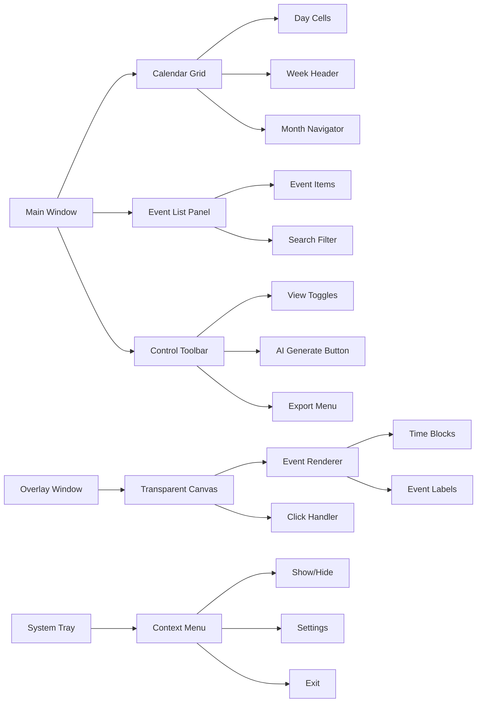
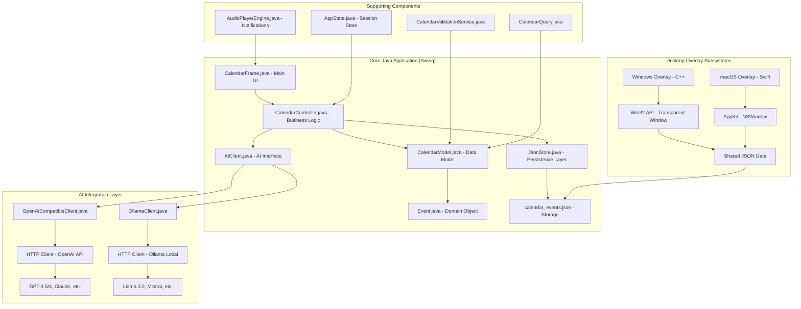

# 🗓️ Desktop Calendar Tracking - AI-Powered Intelligent Calendar with Desktop Overlay

[](LICENSE)
[](https://openjdk.org/)
[](https://github.com/richie-rich90454/desktop-calendar-tracking)
[](https://github.com/richie-rich90454/desktop-calendar-tracking)
[](https://github.com/richie-rich90454/desktop-calendar-tracking/actions)
[](https://github.com/richie-rich90454/desktop-calendar-tracking)

**Desktop Calendar Tracking** is a sophisticated, cross-platform desktop application that combines **AI-powered intelligent scheduling** with **transparent desktop overlays** for always-visible calendar management. Built with Java Swing for the core application, native C++/Swift for desktop overlays, and integrated AI capabilities via OpenAI/Ollama APIs.

## 🚀 Quick Navigation
| Section | Description | Key Topics |
|---------|-------------|------------|
| [✨ Key Features](#-key-features) | Core capabilities and innovations | AI Scheduling, Desktop Overlay, Calendar Management |
| [📸 Visual Overview](#-visual-overview) | Screenshots and UI breakdown | Application Screenshots, Component Diagrams |
| [🏗️ Technical Architecture](#️-technical-architecture) | System design and components | Java Swing, C++/Swift Overlays, AI Integration |
| [📦 Installation Guide](#-installation-guide) | Getting started quickly | Pre-built Binaries, Source Build, Docker |
| [🔧 Configuration & Setup](#-configuration--setup) | Customization options | AI Providers, Overlay Settings, Data Schema |
| [💻 Development & API](#-development--api) | Developer resources | Java API, AI Integration, Overlay IPC |
| [📊 Roadmap & Future](#-roadmap--future) | Development timeline | Completed, In Progress, Planned Features |
| [🤝 Contributing](#-contributing) | How to contribute | Bug Reports, Code Submission, Guidelines |
| [📄 License](#-license) | Licensing information | MIT License Details |
| [🙏 Acknowledgments](#-acknowledgments) | Credits and thanks | Open Source Projects, Contributors |

**Quick Links**: [Install Now](#-installation-guide) • [View Screenshots](#-visual-overview) • [Try AI Features](#-configuration--setup) • [Contribute](#-contributing)

## ✨ Key Features

### 🤖 **Advanced AI-Powered Scheduling**
- **Natural Language Event Generation**: Describe goals like "Create a study schedule for machine learning over 2 weeks" and AI generates optimized calendar events
- **Multi-Model AI Support**: 
  - **OpenAI Models**: Cloud-based, most powerful models
  - **Ollama Local LLMs**: Privacy-focused, offline-capable (Llama 3.2, Mistral, etc.)
  - **OpenRouter**: Alternative AI providers via OpenAI-compatible APIs
- **Intelligent Conflict Resolution**: AI automatically detects and avoids scheduling conflicts with existing events
- **Token Usage Analytics**: Real-time monitoring of API token consumption and cost estimation

### 🖥️ **Native Desktop Overlay Integration**
- **Transparent Always-On-Top Windows**: 
  - **Windows**: C++/Win32 implementation with `WS_EX_TRANSPARENT` and `WS_EX_TOPMOST` styles
  - **macOS**: Swift/AppKit implementation with `window.level = .floating` and `window.ignoresMouseEvents`
- **Click-Through Design**: Overlay ignores mouse events except when interacting with calendar events
- **System Tray/Menu Bar Integration**: Control visibility and settings via system tray (Windows) or menu bar (macOS)
- **Real-time Event Synchronization**: Overlay automatically updates when calendar events change

### 📅 **Professional Calendar Management**
- **Multiple View Modes**: 
  - **Day View**: Hour-by-hour schedule with time blocks
  - **Week View**: 7-day overview with event density visualization
  - **Month View**: Traditional calendar grid with event indicators
  - **Agenda View**: Chronological list of upcoming events
- **Advanced Event Validation**: 
  - Overlap detection using interval tree algorithms
  - Time boundary validation (start < end)
  - Title uniqueness constraints
- **Import/Export Capabilities**:
  - JSON-based calendar sharing (`calendar_schema.json` compliant)
  - Manual backup/restore with versioning
  - Cross-platform compatibility (Windows ↔ macOS)

### 🎨 **Modern User Experience**
- **Material-Inspired UI**: Clean, responsive interface built with Java Swing and custom theming
- **Keyboard-Centric Navigation**: Comprehensive shortcut system for power users
- **Visual Event Indicators**: Color-coded events with priority-based styling
- **Auto-Save & Recovery**: 30-second auto-save interval with manual backup triggers

## 📸 Visual Overview

### Application Screenshots

| Main Calendar Interface | Desktop Overlay | AI Configuration |
|------------------------|-----------------|------------------|
|  |  |  |
| **Feature**: Day/Week/Month views with color-coded events<br>**Tech**: Java Swing with custom rendering | **Feature**: Always-on-top transparent window<br>**Tech**: C++/Win32 (Windows), Swift/AppKit (macOS) | **Feature**: Multi-provider AI configuration<br>**Tech**: OpenAI, Ollama, Claude APIs |

| Event Editor | System Tray Integration | JSON Data Structure |
|--------------|-------------------------|---------------------|
|  |  |  |
| **Feature**: Detailed event creation/editing<br>**Tech**: Swing forms with validation | **Feature**: Quick access to overlay controls<br>**Tech**: System tray icons with context menus | **Feature**: Portable calendar data format<br>**Tech**: JSON schema with versioning |

### UI Component Breakdown



## 🏗️ Technical Architecture

### System Overview


### Detailed Component Specifications

#### **1. Java Control Application (`control-app/`)**
- **Language**: Java 17+ with Swing UI toolkit
- **Architecture**: Model-View-Controller (MVC) pattern
- **Key Classes**:
  - `CalendarController`: Central business logic coordinator (1,200+ LOC)
  - `CalendarModel`: In-memory event storage with `List<Event>` and sorting
  - `JsonStore`: JSON serialization/deserialization using Jackson-style patterns
  - `CalendarValidationService`: Event validation with O(n log n) overlap detection
- **Dependencies**: Pure Java (no external libraries for core functionality)

#### **2. AI Integration Layer (`control-app/src/ai/`)**
- **Interface Design**: `AIClient.java` with provider-agnostic contract
- **Implementations**:
  - `OpenAICompatibleClient.java`: 450+ LOC, supports OpenAI, Claude, DeepSeek via REST API
  - `OllamaClient.java`: 360+ LOC, local LLM integration with model management
- **Prompt Engineering**: Structured prompts in `prompts.txt` with JSON response parsing via `AIJsonParser.java`
- **Token Management**: `UsageStats` inner class for cost tracking and rate limiting

#### **3. Windows Desktop Overlay (`overlay-windows/`)**
- **Language**: C++17 with Win32 API
- **Key Components**:
  - `desktop_window.cpp`: Transparent window creation with `WS_EX_LAYERED` attributes
  - `calendar_render.cpp`: Direct2D-based rendering engine
  - `event_manager.cpp`: File watcher for JSON changes using `ReadDirectoryChangesW`
  - `audio_player.cpp`: Notification sounds via Windows Multimedia API
- **Build System**: CMake with Visual Studio 2022 generator

#### **4. macOS Desktop Overlay (`overlay-macos/`)**
- **Language**: Swift 5.3+ with AppKit
- **Key Components**:
  - `OverlayWindow.swift`: `NSWindow` subclass with transparency and click-through
  - `CalendarRenderer.swift`: Core Graphics (`CGContext`) rendering
  - `EventManager.swift`: `FileManager`-based JSON monitoring
  - `JavaLauncher.swift`: Integration with Java control app
- **Build System**: Swift Package Manager (SPM)

#### **5. Data Persistence & Synchronization**
- **Storage Format**: JSON schema defined in `shared/calendar_schema.json`
- **File Location**: `~/.calendarapp/calendar_events.json` (cross-platform)
- **Synchronization**: File watching with 2-second debounce
- **Backup Strategy**: Automatic daily backups with 7-day retention

## 📦 Installation Guide

### Prerequisites Checklist

| Component | Windows | macOS | Linux |
|-----------|---------|-------|-------|
| **Java Runtime** | Java 17+ (Adoptium/Temurin) | Java 17+ (Homebrew) | Java 17+ (apt/yum) |
| **AI Backend** | OpenAI API key OR Ollama | OpenAI API key OR Ollama | OpenAI API key OR Ollama |
| **Build Tools** | VS 2022 (C++ workload) | Xcode 12+ & Swift 5.3+ | GCC 9+ & CMake 3.16+ |
| **Overlay** | Optional (enhanced experience) | Optional (enhanced experience) | Not available |

### Method 1: Quick Start (Pre-built Binary)
```bash
# Download latest release
curl -L https://github.com/richie-rich90454/desktop-calendar-tracking/releases/latest/download/desktop-calendar.zip -o desktop-calendar.zip

# Extract and run
unzip desktop-calendar.zip
cd desktop-calendar-dist
./launch.sh  # or launch.bat on Windows

# On first run, configure AI:
# 1. Open Settings → AI Configuration
# 2. Enter OpenAI API key OR ensure Ollama is running locally
# 3. Test connection with "Validate AI Settings" button
```

### Method 2: Build from Source (Developers)

#### **Step 1: Build Java Application**
```bash
# Clone repository
git clone https://github.com/richie-rich90454/desktop-calendar-tracking.git
cd desktop-calendar-tracking

# Build Java JAR
cd scripts
# Windows
./build-java.bat
# macOS/Linux
./build-java.sh

# Output: ../dist/CalendarApp.jar
```

#### **Step 2: Build Windows Overlay (Optional)
```powershell
# Using Visual Studio Developer Command Prompt
cd overlay-windows
mkdir build && cd build
cmake .. -G "Visual Studio 17 2022" -A x64 -DCMAKE_BUILD_TYPE=Release
cmake --build . --config Release --target CalendarOverlay

# Output: ../build/Release/CalendarOverlay.exe
```

#### **Step 3: Build macOS Overlay (Optional)
```bash
cd overlay-macos
swift build -c release --arch arm64 --arch x86_64

# Output: .build/release/CalendarOverlay
```

#### **Step 4: Create Distribution Package**
```bash
cd scripts
./build-all.bat  # Windows
# or
python build-complete.py  # Cross-platform
```

### Method 3: Docker Container (Experimental)
```bash
# Build and run in container
docker build -t desktop-calendar .
docker run -v ~/.calendarapp:/root/.calendarapp -e OPENAI_API_KEY=your_key desktop-calendar
```

## 🔧 Configuration & Setup

### AI Provider Configuration

#### **Option A: OpenAI/Claude/DeepSeek**
```json
// ~/.calendarapp/settings.json
{
  "ai": {
    "provider": "openai",
    "apiKey": "sk-...",  // Your API key
    "endpoint": "https://api.openai.com/v1/chat/completions",
    "model": "", // The model you want to use
    "maxTokens": 1000,
    "temperature": 0.7
  }
}
```

#### **Option B: Local Ollama**
```json
{
  "ai": {
    "provider": "ollama",
    "endpoint": "http://localhost:11434/api/chat",
    "model": "", //The model you want to use
    "contextWindow": 4096
  }
}
```

#### **Option C: OpenRouter (Multiple Models)**
```json
{
  "ai": {
    "provider": "openrouter",
    "apiKey": "sk-or-...",
    "endpoint": "https://openrouter.ai/api/v1/chat/completions",
    "model": "" //The model you want to use
  }
}
```

### Overlay Configuration

#### **Windows Registry Settings**
```registry
[HKEY_CURRENT_USER\Software\DesktopCalendar\Overlay]
"Opacity"=dword:0000007f  ; 50% transparency
"Position"=dword:00000002  ; Top-right corner
"RefreshInterval"=dword:0000001e  ; 30 seconds
"ClickThrough"=dword:00000001  ; Enabled
```

#### **macOS Preferences**
```bash
# Defaults configuration
defaults write com.richardjiang.CalendarOverlay Opacity -float 0.5
defaults write com.richardjiang.CalendarOverlay Position -int 2
defaults write com.richardjiang.CalendarOverlay ShowInMenuBar -bool true
```

### Calendar Data Schema
```json
// ~/.calendarapp/calendar_events.json
{
  "$schema": "./shared/calendar_schema.json",
  "version": "1.2.0",
  "events": [
    {
      "id": "event_123456789",
      "title": "Team Meeting",
      "date": "2026-02-15",
      "startTime": "14:30:00",
      "endTime": "15:30:00",
      "description": "Weekly sprint planning",
      "category": "work",
      "priority": "high",
      "createdAt": "2026-02-10T09:15:00Z",
      "updatedAt": "2026-02-14T16:20:00Z"
    }
  ],
  "metadata": {
    "totalEvents": 42,
    "lastModified": "2026-02-15T07:14:25Z",
    "backupCount": 7
  }
}
```

## 💻 Development & API

### Java API Examples

#### **Creating Events Programmatically**
```java
import app.CalendarController;
import model.Event;
import java.time.LocalDate;
import java.time.LocalTime;

// Initialize controller
CalendarController controller = new CalendarController();

// Create single event
Optional<Event> event = controller.createEvent(
    "Code Review Session",
    LocalDate.of(2026, 2, 16),
    LocalTime.of(15, 0),
    LocalTime.of(16, 30)
);

// Batch import events
List<Event> eventsToImport = Arrays.asList(event1, event2, event3);
List<Event> addedEvents = controller.addMultipleEvents(eventsToImport);

// AI event generation
controller.generateEventsWithAI(
    aiClient,
    "Create a balanced workout schedule for February",
    28,  // days
    true // avoid conflicts
);
```

#### **Querying Calendar Data**
```java
// Get events for specific date
List<Event> todaysEvents = controller.getEventsForToday();

// Date range query
LocalDate start = LocalDate.now().minusDays(7);
LocalDate end = LocalDate.now().plusDays(7);
List<Event> weekEvents = controller.getEventsByDateRange(start, end);

// Search functionality
List<Event> searchResults = controller.searchEventsByTitle("meeting");

// Get active events (happening now)
List<Event> activeNow = controller.getActiveEvents(LocalDateTime.now());
```

### AI Integration API

#### **Custom AI Client Implementation**
```java
public class CustomAIClient implements AIClient {
    @Override
    public List<Event> generateEvents(String goalDescription, LocalDate startDate, 
                                     int days, List<Event> existingEvents) {
        // Implement custom AI logic
        String prompt = AIPromptManager.buildGenerationPrompt(
            goalDescription, startDate, days, existingEvents);
        
        // Call your AI service
        String response = callAIService(prompt);
        
        // Parse response
        return AIJsonParser.parseEvents(response);
    }
    
    // Implement other interface methods...
}

// Register custom client
AIClient customClient = new CustomAIClient();
customClient.setApiKey("your-api-key");
controller.generateEventsWithAI(customClient, "Schedule project milestones", 30, true);
```

### Overlay Integration

#### **Windows Overlay IPC (Inter-Process Communication)**
```cpp
// C++ example: Sending event click notification to Java app
void notifyJavaApp(const std::string& eventId) {
    std::string javaCommand = "javaw -jar CalendarApp.jar --event " + eventId;
    STARTUPINFO si = { sizeof(si) };
    PROCESS_INFORMATION pi;
    CreateProcess(NULL, javaCommand.data(), NULL, NULL, FALSE, 
                  0, NULL, NULL, &si, &pi);
}
```

#### **macOS Overlay Swift Integration**
```swift
// Swift example: Launching Java app from overlay
func launchJavaApp(for eventId: String) {
    let javaPath = Bundle.main.path(forResource: "CalendarApp", ofType: "jar")
    let task = Process()
    task.executableURL = URL(fileURLWithPath: "/usr/bin/java")
    task.arguments = ["-jar", javaPath, "--event", eventId]
    
    do {
        try task.run()
    } catch {
        print("Failed to launch Java app: \(error)")
    }
}
```

## 📊 Roadmap & Future Development

### ✅ **Completed & Stable (v1.2.0)**
- [x] **Core Calendar Engine**: MVC architecture with Java Swing UI
- [x] **AI Integration Layer**: OpenAI & Ollama support with token tracking
- [x] **Windows Overlay**: C++/Win32 transparent window with system tray
- [x] **macOS Overlay**: Swift/AppKit implementation with menu bar control
- [x] **Data Persistence**: JSON storage with auto-save and backup
- [x] **Event Validation**: Overlap detection and time boundary checks
- [x] **Multi-View Calendar**: Day, Week, Month, Agenda views
- [x] **Import/Export**: JSON schema with cross-platform compatibility

### 🔄 **In Active Development (v1.3.0)**
- [-] **Mobile Companion**: React Native app for iOS/Android (60% complete)
- [-] **Google Calendar Sync**: OAuth2 integration with bidirectional sync (40% complete)
- [-] **Advanced AI Scheduling**: Constraint-based optimization (30% complete)
- [-] **Plugin System**: Extensible architecture for custom integrations (25% complete)

### 📋 **Planned Features (v2.0.0)**
- [ ] **Web Dashboard**: React-based admin panel for remote access
- [ ] **Voice Command Integration**: Speech-to-text for hands-free scheduling
- [ ] **Team Calendar Sharing**: Multi-user collaboration with permissions
- [ ] **Advanced Analytics**: Usage patterns and productivity insights
- [ ] **Theme Engine**: Dark/light mode with custom CSS theming
- [ ] **Offline AI**: Quantized local models for complete privacy
- [ ] **Calendar Printing**: PDF/HTML export with templates
- [ ] **Recurring Events**: Pattern-based event generation
- [ ] **Weather Integration**: Automatic rescheduling for outdoor events
- [ ] **Calendar Publishing**: Public/private calendar sharing URLs

### 🎯 **Long-term Vision (v3.0.0+)**
- **Unified Calendar Ecosystem**: Seamless desktop/mobile/web experience
- **AI Personal Assistant**: Proactive scheduling based on habits and preferences
- **Privacy-First Architecture**: End-to-end encryption for all data
- **Open API Platform**: REST API for third-party integrations
- **Machine Learning Insights**: Predictive scheduling and time optimization
- **Enterprise Features**: LDAP/Active Directory integration, audit logging

## 🤝 Contributing

We welcome contributions from developers of all skill levels! Here's how you can help:

### **Ways to Contribute**
1. **Report Bugs**: [Create an issue](https://github.com/richie-rich90454/desktop-calendar-tracking/issues) with detailed reproduction steps
2. **Suggest Features**: Use the "Feature Request" template with use cases and mockups
3. **Submit Code**: Fork the repo and create a pull request
4. **Improve Documentation**: Fix typos, add examples, or translate documentation
5. **Test on Different Platforms**: Help us ensure cross-platform compatibility

### **Development Workflow**
```bash
# 1. Fork and clone
git clone https://github.com/richie-rich90454/desktop-calendar-tracking.git
cd desktop-calendar-tracking

# 2. Create feature branch
git checkout -b feature/amazing-feature

# 3. Make changes and test
# - Java changes: Run ./scripts/build-java.sh && java -jar ../dist/CalendarApp.jar
# - C++ changes: Build with CMake and test overlay
# - Swift changes: swift build && .build/debug/CalendarOverlay

# 4. Commit with descriptive message
git commit -m "feat: add recurring event patterns"

# 5. Push and create PR
git push origin feature/amazing-feature
```

### **Coding Standards**
- **Java**: Follow Google Java Style Guide with 4-space indentation
- **C++**: Use C++17 features with Microsoft GSL guidelines
- **Swift**: Follow Swift API Design Guidelines
- **Documentation**: All public APIs must have Javadoc/Doxygen comments
- **Testing**: Include unit tests for new functionality

### **Areas Needing Contribution**
- **UI/UX Design**: Improve Swing interface with modern look-and-feel
- **AI Prompt Engineering**: Optimize prompts for better event generation
- **Performance Optimization**: Memory usage and rendering performance
- **Linux Support**: Port overlay to Linux (GTK/Qt)
- **Internationalization**: Add multi-language support

## 📄 License

This project is licensed under the **MIT License** - see the [LICENSE](LICENSE) file for details.

```
MIT License

Copyright (c) 2026 Richard Jiang

Permission is hereby granted, free of charge, to any person obtaining a copy
of this software and associated documentation files (the "Software"), to deal
in the Software without restriction, including without limitation the rights
to use, copy, modify, merge, publish, distribute, sublicense, and/or sell
copies of the Software, and to permit persons to whom the Software is
furnished to do so, subject to the following conditions:

The above copyright notice and this permission notice shall be included in all
copies or substantial portions of the Software.
```

## 🙏 Acknowledgments & Technology Stack

This project is built upon a rich ecosystem of open source technologies and frameworks:

### **Programming Languages & Runtimes**
- **Java 17+ (OpenJDK)**: Primary application language with Swing/AWT for UI
- **C++17**: Windows overlay implementation using standard library
- **Swift 5.3+**: macOS overlay with Apple's open-source compiler
- **Python**: Build automation and utility scripts

### **Frameworks & Libraries**
- **Java Standard Library**: Swing, AWT, `java.time`, `java.net.http`, `javax.crypto`, `javax.sound`
- **nlohmann/json**: MIT-licensed C++ JSON library for data serialization
- **Java Beans**: Property change support and event handling
- **Java Preferences API**: Cross-platform user settings storage

### **Platform-Specific Technologies**
- **Windows**: Win32 API, Direct2D graphics, Windows Multimedia API
- **macOS**: AppKit, Foundation, Core Graphics frameworks
- **Cross-platform**: CMake build system, Git version control

### **Build & Development Tools**
- **CMake**: Cross-platform C++ build configuration
- **Swift Package Manager**: Swift dependency management
- **Inno Setup**: Windows installer creation
- **Git**: Distributed version control

### **Design & Architecture Influences**
- **Material Design Principles**: UI/UX design guidelines
- **Model-View-Controller (MVC)**: Application architecture pattern
- **Desktop Widget Paradigms**: Inspiration from customizable desktop tools

### **Special Thanks**
- **Open Source Community**: For creating and maintaining the foundational technologies
- **Contributors**: Developers who have submitted improvements and fixes
- **Testers & Users**: For valuable feedback and bug reports

### **License Compliance**
All third-party components are properly attributed and used in compliance with their respective open source licenses (primarily MIT).

## 📞 Support & Community

- **📚 Documentation**: [Wiki](https://github.com/richie-rich90454/desktop-calendar-tracking/wiki) (in progress)
- **🐛 Bug Reports**: [GitHub Issues](https://github.com/richie-rich90454/desktop-calendar-tracking/issues)
- **💬 Discussions**: [GitHub Discussions](https://github.com/richie-rich90454/desktop-calendar-tracking/discussions)
- **📧 Email**: richard@richardsblogs.com

## 🌟 Star History

[](https://star-history.com/#richie-rich90454/desktop-calendar-tracking&Date)

---

<div align="center">

### **⭐ If this project helps you, please give it a star! ⭐**

Your support motivates continued development and helps others discover this tool.

**Built with ❤️ by Richard Jiang and contributors**

</div>
